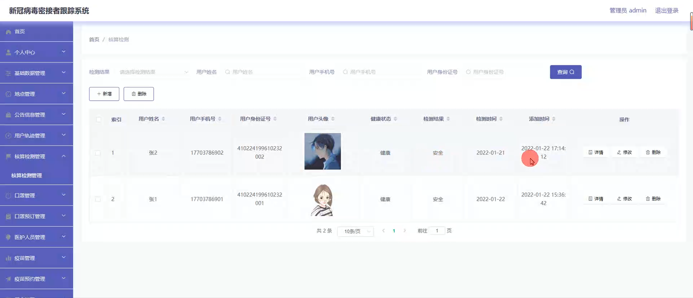

# 基于springboot的新冠病毒密接者跟踪系统

<h4 style='color:red'>联系不到我，就看我的主页 </h4> 
 
#### 介绍

在新冠疫情防控的背景下，为了更有效地追踪新冠病毒密切接触者，保障公众健康和安全，我们开发了这个基于 Spring Boot 的新冠病毒密接者跟踪系统。该系统旨在为管理端、医护人员端和用户端提供全面、精准的信息和便捷的操作，助力疫情防控工作。

#### 技术栈

后端技术栈：Springboot+Mysql+Maven

前端技术栈：Vue+Html+Css+Javascript+ElementUI

开发工具：Idea+Vscode+Navicate

#### 系统功能介绍

（一）管理端  
个人中心：管理端人员可在此查看和修改个人信息，接收系统通知和重要消息。  
基础数据管理：维护系统所需的基础数据，如行政区划、人口信息等，为后续的分析和决策提供数据支持。  
地点管理：对可能存在病毒传播风险的地点进行登记和管理，包括地点名称、地址、风险等级等信息。  
公告信息管理：发布疫情防控相关的公告，如政策调整、防控措施、风险提示等，确保公众及时了解最新情况。  
用户轨迹管理：通过大数据分析等技术手段，获取和管理用户的行动轨迹，以便快速确定密接者。  
核酸检测管理：统筹核酸检测工作，包括检测点的设置、检测人员的安排、检测结果的录入和统计等。  
口罩管理：监控口罩的库存、调配和发放情况，确保口罩的供应充足和合理分配。  
口罩预订管理：处理用户的口罩预订申请，安排口罩的配送或领取事宜。  
医护人员管理：对医护人员的信息进行登记、调配和工作安排，确保医护资源的合理利用。  
疫苗管理：管理疫苗的库存、配送和接种情况，包括疫苗的种类、批次、有效期等信息。  
疫苗预约管理：处理用户的疫苗预约申请，合理安排接种时间和地点。  

（二）医护人员端  
个人中心：医护人员在此查看和修改个人信息，了解工作安排和任务提醒。  
地点管理：实时更新和查看风险地点的信息，为防控工作提供参考。  
公告信息管理：及时了解最新的疫情防控公告和工作要求。  
用户轨迹管理：协助追踪用户轨迹，确定密接者范围。  
核酸检测管理：具体执行核酸检测工作，包括样本采集、检测结果录入等。  
口罩管理：参与口罩的发放和管理工作，确保居民的口罩需求得到满足。  
口罩预订管理：处理居民的口罩预订，协调预订和发放流程。  
疫苗管理：参与疫苗的接种工作，记录接种信息和不良反应。  
疫苗预约管理：安排疫苗接种的预约，确保接种工作有序进行。  
用户管理：对用户的基本信息和健康状况进行管理和更新。  

（三）用户端  
个人中心：用户可以查看自己的个人信息、核酸检测记录、疫苗接种情况等。  
公告信息管理：及时获取官方发布的疫情防控公告和相关信息。  
用户轨迹管理：主动上报自己的行动轨迹，协助疫情防控工作。  
核酸检测管理：查看核酸检测的安排和结果。  
口罩管理：了解口罩的相关信息，进行口罩预订。  
口罩预订管理：跟踪口罩预订的状态和领取方式。  
疫苗管理：获取疫苗的相关知识和接种通知。  
疫苗预约管理：进行疫苗接种的预约操作。  

#### 系统作用

新冠病毒密接者跟踪系统的主要作用包括：  

提升疫情防控效率： 提供一个集中和便捷的平台，帮助公共卫生部门高效地追踪和管理密切接触者。  
优化用户体验： 通过丰富的功能模块，让用户能够轻松管理个人健康信息、预约核酸检测和疫苗接种、查看公告等。  
信息传递： 通过公告信息和地点管理，管理端和医护人员可以及时向用户传递最新的疫情信息和防控措施。  
安全保障： 通过用户轨迹管理和核酸检测管理，增强疫情防控的精准性，确保公共安全。  

#### 系统功能截图

代码结构

数据库表

登录

基础数据管理

疫苗类型管理

公告信息管理

用户轨迹管理

核酸检测管理

口罩预约管理

疫苗管理

用户管理

用户端用户轨迹管理

疫苗预约管理

医护人员端的疫苗预约管理

#### 总结

基于 Spring Boot 的新冠病毒密接者跟踪系统通过清晰的角色划分和全面的功能模块，为疫情防控工作提供了有力的支持。管理端能够进行统筹规划和资源调配，医护人员端能够高效执行防控任务，用户端能够方便地获取信息和参与防控。在疫情防控的关键时期，该系统有助于提高防控的科学性、精准性和有效性，保障公众的生命健康。未来，随着疫情形势的变化和防控需求的调整，系统将不断优化和完善，为应对类似公共卫生事件提供更强大的技术支撑。

#### 使用说明

创建数据库，执行数据库脚本 修改jdbc数据库连接参数 下载安装maven依赖jar 启动idea中的springboot项目

后台登录页面
http://localhost:8080/jiechuzhe/admin/dist/index.html

管理员 			账户:admin 	密码：admin
医生 			账户:a1 		密码：123456
用户 			账户:a1 		密码：123456
用户 			账户:a2 		密码：123456
